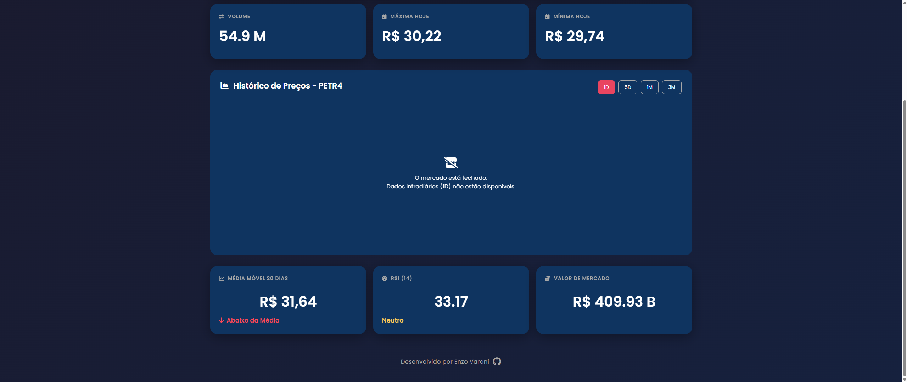

# Dashboard do Mercado Financeiro (em tempo real)


Uma plataforma de visualização de dados do mercado financeiro em tempo real, construída do zero com Node.js no backend e JavaScript puro no frontend.

**[Link para o Deploy do Projeto (Vercel)](https://coloque-seu-link-aqui.vercel.app)**

<table align="center">
  <tr>
    <td align="center">
      
    </td>
    <td align="center">      
      
    </td>
  </tr>
</table>

---

### Sobre o Projeto

O projeto começou com um objetivo simples: exibir os dados de uma única ação da bolsa brasileira, a PETR4. A partir daí, a aplicação evoluiu para incluir um ticker com múltiplos ativos, um gráfico interativo com dados históricos e o cálculo em tempo real de indicadores técnicos.

### Minha Jornada e Decisões Técnicas

A construção deste dashboard foi uma jornada de aprendizado imensa, principalmente no que diz respeito ao consumo de APIs externas.

1.  **A Escolha da Stack:** Optei por **Node.js** com **Express** para o backend pela sua performance e por ser um padrão de mercado para APIs REST. No frontend, decidi começar com **JavaScript puro** para solidificar meus fundamentos de manipulação do DOM e lógica de cliente antes de avançar para um framework como React.

2.  **A Saga das APIs:** O maior desafio foi encontrar e integrar fontes de dados gratuitas e confiáveis.
    - Comecei com a API do **Yahoo Finance**, mas rapidamente enfrentei problemas de instabilidade e `timeouts`, o que me levou a buscar alternativas.
    - Migrei para a **Brapi**, uma API focada no mercado brasileiro. Ela se mostrou excelente para cotações de ações e índices.

3.  **Deploy:** Para a publicação, escolhi um stack moderno com **Railway** para o backend e **Vercel** para o frontend. A integração contínua com o GitHub, onde cada `push` automaticamente atualiza a aplicação, foi uma experiência fantástica de CI/CD.

### Tecnologias Utilizadas

-   **Backend:** Node.js, Express.js, Axios
-   **Frontend:** HTML5, CSS3, JavaScript (ES6+), Chart.js
-   **API:** Brapi
-   **Deploy:** Railway (Backend), Vercel (Frontend)
-   **Ferramentas:** Git, GitHub, VS Code, nodemon

### Principais Aprendizados

-   **Arquitetura Full-Stack:** Entender na prática o fluxo completo de uma requisição, desde o clique no cliente até a resposta da API, passando por rotas, controllers e serviços no backend.
-   **Consumo e Resiliência de APIs:** Lidar com `timeouts`, `rate limits`, e diferentes formatos de dados me ensinou a importância da programação defensiva e de não depender de uma única fonte de dados.
-   **Cálculo de Indicadores:** Implementar do zero a lógica para calcular a Média Móvel Simples (MMS) e o Índice de Força Relativa (IFR) a partir de dados históricos foi um desafio que aprofundou meu conhecimento em manipulação de dados.
-   **Assincronismo:** O uso intensivo de `async/await` e `Promise.all` tanto no backend quanto no frontend foi essencial para garantir que a aplicação se mantivesse performática e sem travamentos.
-   **Deploy e CI/CD:** O processo de deploy na Railway e Vercel me deu uma visão clara de como um projeto sai do ambiente local para a web, incluindo a configuração de variáveis de ambiente e o fluxo de integração contínua.

### Como Rodar Localmente

```bash
# 1. Clone o repositório
git clone [https://github.com/seu-usuario/financial-dashboard.git]
cd pr

# 2. Configure e rode o Backend
cd backend
npm install

# Crie um arquivo .env na pasta /backend e adicione sua chave da Brapi
# BRAPI_API_TOKEN=SUA_CHAVE_AQUI

npm run dev
# O servidor estará rodando em http://localhost:3001

# 3. Rode o Frontend (com Live Server)
Pré-requisito: Tenha a extensão Live Server instalada no seu VS Code.
No VS Code, navegue até a pasta frontend.
Clique com o botão direito no arquivo index.html.
Selecione a opção "Open with Live Server".
Seu navegador abrirá automaticamente no endereço http://127.0.0.1:5500 (ou uma porta similar) com o projeto funcionando.

### Objetivos Futuros do Projeto:

[ ] Busca de Ativos: Implementar uma barra de busca para que o usuário possa trocar o ativo principal (PETR4) por qualquer outra ação da B3.

[ ] Internacionalização: Adicionar uma opção para visualizar o dashboard em Inglês.

[ ] Melhorias de UI/UX: Refinar o layout, adicionar mais animações, um seletor de tema (light/dark) e tornar a interface mais responsiva para dispositivos móveis.

[ ] Migração para React: Evoluir o frontend de Vanilla JS para React, componentizando a aplicação e gerenciando o estado de forma mais eficiente.

Autor
Enzo Varani

GitHub: @EnzoVarani

LinkedIn: (https://www.linkedin.com/in/enzo-varani-68483b264)
